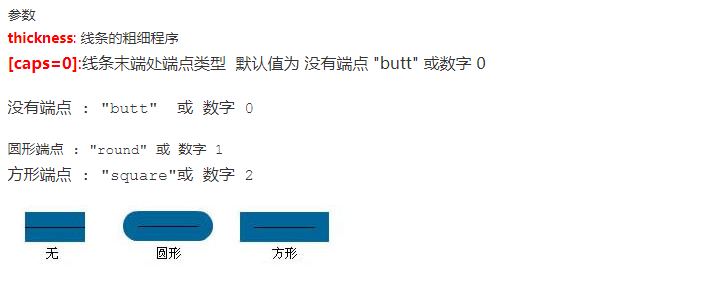
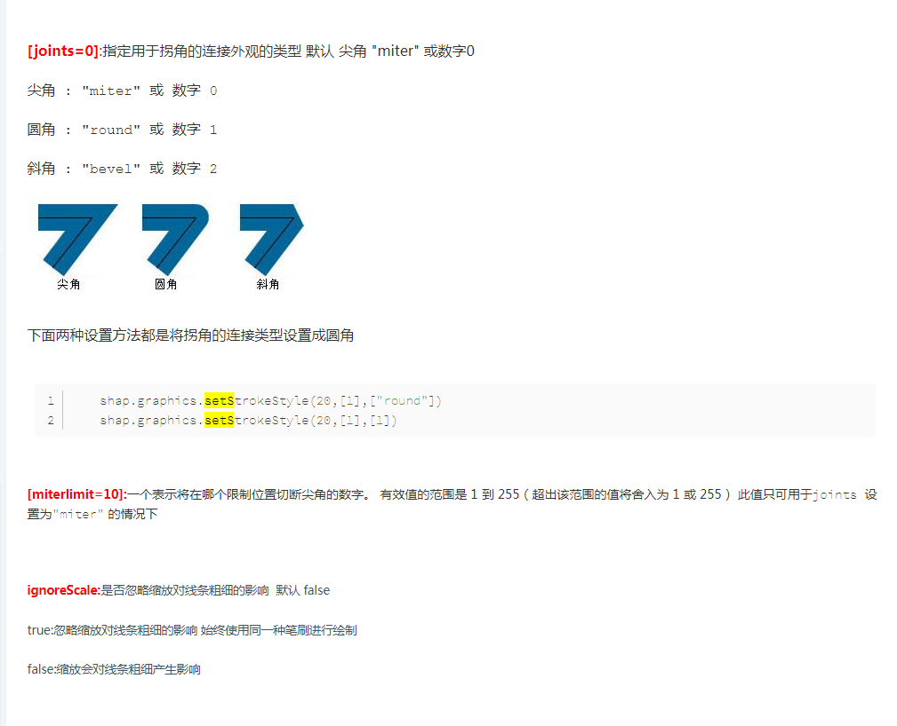

# stage
>`const stage=new createjs.Stage("id");`新建舞台。一切都在舞台上开始
>> 每当新建一个元素后都需要`addChild()`向舞台中添加内容，可直接用stage，也可以用**container**<br>
   stage是透明的 直接```stage.addEventListener("click",function(e){
        console.log("stage be clicked")
    })```<br>
    一般不会触发**click**。可以用`mousedown`取代`click`

# container
>`const stage=new createjs.Container()`新建容器。很多时候我们不能直接对舞台进行操作，会影响别的元素。此刻对容器进行操作再方便不过

# bitMap()
>用于显示图片，一般等图片加载完调用，即在`image.onload()`函数里调用最好。也可以`createjs.Ticker.addEventListener("tick",stage)`函数一直刷新舞台。可以通过`getBounds()`获取宽高，也可也通过**x**,**y**来设置位置

# shape
## graphics
### drawRect(x,y,w,h,radius)
>绘矩形，**x**,**y**,为位置，**w**,**h**为宽高。**radius**是圆角弧度，默认为0
### beginFill("color")
>填充颜色用来，一般和**endFill**一起用，此外还有`beginRadialGradientFill()`、`beginLinearGradientFill()`来进行径向渐变或者线行渐变。也可以`beginBitmapFill()`进行图像填充
### drawCircle(x,y,r)
>graphics方法，用于画圆 **x**,**y**为圆心位置,**r**为半径
### beginPath()
>开始新的绘制
### moveTo(x,y)
>设置绘制起点
### lineTo(x,y)
>与moveTo(x,y)搭配便可以进行直线绘图
### drawRoundRect(x,y,w,h)
>绘制椭圆。**x**,**y**为位置,**w**,**h**是宽高
### drawPolyStar(x,y,radius,sides,pointSize,angle)
>绘制星星 **sides**为角/边数。**pointSize**为角的深度 越小越接近正边形。**angle**第一个点/角的角度,例如,值为0时表示在中心点的右侧开始绘制第一个点 0的话刚开始有点倾斜
### bezierCurveTo(x1,y1,x2,y2,x3,y3)
>绘制贝塞尔曲线。**(x1,y1)**,**(x2,y2)**....分别为三个控制点
### quadraticCurveTo(x2,y2,x3,y3)
>绘制贝塞尔曲线。但是参数里没有起点，需要先定义起点。`movrTo(x1,y1).quadraticCurveTo(x2,y2,x3,y3)`
### beginStroke("color")
>线条颜色可以利用
`setStrokeStyle(thickness,[caps=0],[joins=0],[miterLimit=0],[ignoreScale=false])`
。
还可以`setStrokeDash([segments],[offset=0])`<br>
**[segments]**: 指定虚线模式的数组,链接和空隙之间交替出现的形式,例如[20,10]表示先绘制一条20像素的线段,再空10像素间隔,再绘制20像素的线段,再空10像素间隔,以此类推.设置一个null值 或一个 空数组将清除线段的虚线模式<br>
**[offset]**: 虚线的偏移量 可以利用这个属性 来制作蚂蚁线效果


# text
> `const text=new createjs.Text("内容","30px Arial","color");`可以通过**getBounds()**来获取当前文本的宽高，再结合canvas舞台的宽高将文字进行各种定位

# DOMElement
> 可以在`canvas`里面添加dom元素。貌似没有全部开发完，但是差不多够用了

# Ticker
> `createjs.Ticker.addEventListener('tick',function(){})`可以利用 `createjs.Ticker.setFPS()`设置帧数。帧数越大速度越快


